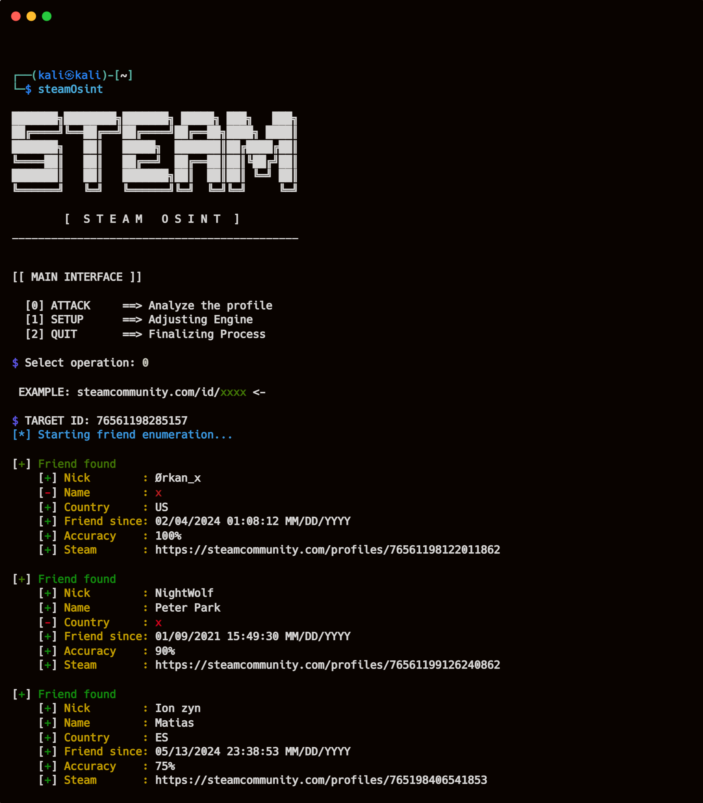

# Steam OSINT 🔍  
### Open Source Intelligence Tool for Steam

**Steam OSINT** is an **open source intelligence (OSINT) tool for Steam** designed to analyze **mutual friends**, map relationship patterns, and identify **potential connections outside the Steam platform**.

This project is built for **OSINT researchers**, cybersecurity enthusiasts, investigators, and anyone interested in **Steam profile analysis**.

---

## 🔎 What is Steam OSINT?

Steam OSINT focuses on **Steam OSINT investigations** by analyzing **public Steam profile data** to:

- Discover **mutual friends** between Steam users  
- Identify hidden or indirect relationships  
- Support **open source intelligence (OSINT)** investigations  
- Use Steam as a **social graph data source**

By correlating public Steam information, this tool helps uncover **connections that may exist beyond Steam**.

---

## 🚀 Features

- Mutual friends analysis on Steam  
- Steam OSINT profile investigation  
- Identification of external social connections  
- Cross-platform support (**Windows & Linux**)  
- Simple and fast **Command-Line Interface (CLI)**

---

## 🧠 Use Cases

- Open Source Intelligence (OSINT) investigations  
- Steam social graph and network analysis  
- Digital footprint research  
- Personal analytics and data exploration  
- Cybersecurity and research projects

---

## 💻 Installation (Linux / Windows)

Clone the repository and install the tool:

```
git clone https://github.com/matiash26/Steam-OSINT-TOOL.git
cd Steam-OSINT-TOOL/
python -m pip install .
```
## ➡️ How to run
```m
steamosint
```